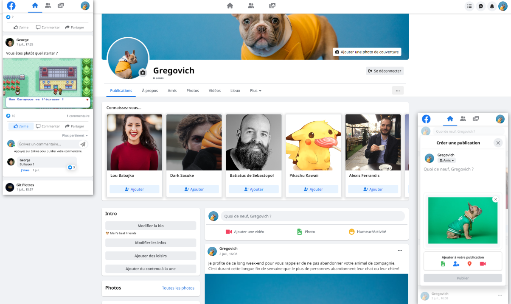

# FACEDOOK

## Lite version of Facebook with Express, React, Redux, Mongo and Node



#### Back

-   CRUD on user & posts
-   Authentification
-   Bcrypt, jwt, multer
-   Upload image

#### Front

-   Authentification
-   Redux
-   Profil update
-   Follow/Unfollow
-   Feed
-   Like/Unlike
-   Infinite scroll
-   CRUD post
-   CRUD comment
-   POST Form
-   Video integration
-   Image integration
-   Trending
-   Friends proposition

---

### Back config :

-   Put your cluster info inside `/config/db.js`
-   Create `.env` file inside `/config/` within the following data
    -   PORT= `your localhost port`
    -   CLIENT_URL= `your client url`
    -   DB_USER_PASS= `your ID & password`
    -   TOKEN_SECRET= `your random secret key`

---

### Front config :

-   Create a `.env` file within the server URL :
    -   REACT_APP_API_URL= `your server url`

---

## Setup

To run this project, install it locally using npm:

```
$ cd ./client
$ npm install
$ npm start
```

```
$ cd ./server
$ npm install
$ nodemon server
```
